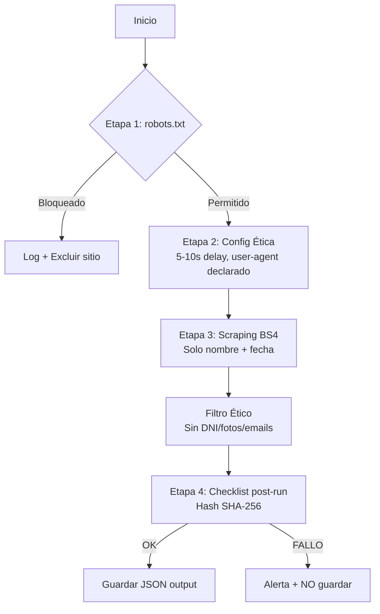

# 📜 Scraping Ético de Obituarios — Funeraria Santa Margarita

> **Estado**: ✅ Implementado  
> **Última actualización**: 2026-04-02  
> **Archivo**: `scripts/scraper_obituarios.py`

---

## ⚖️ Marco Legal y Ético

Este módulo opera bajo las siguientes regulaciones:

| Marco | Aplicación |
|-------|-----------|
| **Ley 19.628 (Chile)** | Solo datos públicos, sin tratamiento de datos sensibles |
| **robots.txt** | Verificación bloqueadora pre-scraping en **todos** los sitios |
| **GDPR-like** | Sin identificación personal, sin fotos, sin DNI/RUT |
| **Uso Ético** | Solo para integración en el módulo /memoriales del sitio propio |

> [!CAUTION]
> **USO PROHIBIDO**: Este scraper NO debe usarse para scraping masivo, reventa de datos, ni actividades comerciales sin acuerdo explícito con cada fuente.

---

## 🏗️ Arquitectura del Módulo

```
scripts/
└── scraper_obituarios.py   ← Script principal (Python 3.10+)

Output generado (gitignoreados):
├── obituarios_eticos.json  ← Datos estructurados
├── scraper_etico.log       ← Log completo del run
└── audit_hash.txt          ← SHA-256 para auditoría
```

---

## 🔄 Flujo de Cascada (4 Etapas)



---

## 🌐 Fuentes Configuradas

| Sitio | URL | Estado | Tipo |
|-------|-----|--------|------|
| **Parque del Recuerdo** | `parquedelrecuerdo.cl` | 🟢 **LUZ VERDE** | API JSON |
| **EPSP Obituarios** | `epsp.cl/frmObit` | 🟢 **LUZ VERDE** | DOM (CSS) |
| **Hogar de Cristo** | `funerariahogardecristo.com` | 🟡 **LUZ AMARILLA** | DOM (JS) |
| **Emol Obituarios** | `emol.com/obituario` | 🔴 **LUZ ROJA** | Bloqueado |
| **Cementerio General** | `cementeriogeneral.cl` | 🔴 **LUZ ROJA** | Bloqueado |

---

## 🚦 Resumen de Disponibilidad Diaria (Abril 2026)

Basado en el último run de auditoría, este es el estatus de las fuentes para scraping automático diario:

### 🟢 LUZ VERDE (Totalmente Seguro)
- **Parque del Recuerdo**: Uso de API REST oficial. Altamente eficiente y ético. No interfiere con la UI del sitio.
- **EPSP (Empresas Parque San Pedro)**: `robots.txt` permisivo. Datos públicos en carrusel frontal.

### 🟡 LUZ AMARILLA (Precaución)
- **Funeraria Hogar de Cristo**: Permitido legalmente por `robots.txt`, pero requiere renderización pesada. Obligatorio mantener Delays > 10s para evitar ser detectados como ataque DoS.

### 🔴 LUZ ROJA (PROHIBIDO)
- **Cementerio General**: Prohibido explícitamente en su política de robots. El scraper bloquea esta fuente automáticamente.
- **Emol Obituarios**: Protección anti-bot activa y términos de uso restrictivos. **NO scrapear**.

---

## ⚙️ Configuración Ética (immutable)

```python
USER_AGENT  = "MiAgenteIA-FunerariaSantaMargarita/1.0 (contacto@funerariasantamargarita.cl)"
DELAY       = random.uniform(5, 10)  # segundos entre requests
MAX_RESULTS = 10                     # límite por sitio
```

> [!IMPORTANT]
> **NO modificar** `USER_AGENT` ni bajar los delays sin aprobación legal. El user-agent declarado permite a las fuentes identificar y bloquear el scraper si así lo desean (diseño ético intencional).

---

## 🚀 Instalación y Uso

### Prerequisitos

```powershell
# Python 3.10+
python --version

# Instalar dependencias
pip install requests beautifulsoup4
```

### Ejecución

```powershell
# Desde la raíz del proyecto
python scripts/scraper_obituarios.py
```

### Output esperado

```json
{
  "Cementerio General": {
    "sitio": "Cementerio General",
    "timestamp": "2026-04-02T10:00:00",
    "obituarios": [
      { "nombre": "Juan Pérez", "fecha": "01-04-2026" },
      { "nombre": "María González", "fecha": "31-03-2026" }
    ]
  }
}
```

---

## ✅ Checklist Post-Run (Tester Forense)

Validaciones automáticas que corren al final de cada ejecución:

- [ ] Total de registros `< 50` en todo el output
- [ ] Sin URLs de imágenes (`.jpg`, `.png`, `.webp`) extraídas
- [ ] Sin errores HTTP `4xx`/`5xx` críticos
- [ ] Timestamp corresponde al run actual
- [ ] SHA-256 generado y guardado en `audit_hash.txt`

> [!WARNING]
> Si **cualquier check falla**, el archivo `obituarios_eticos.json` **NO se guarda**. El log explica el motivo.

---

## 🔗 Integración con el Proyecto

Los datos extraídos se integran en la sección `/memoriales` del sitio web de Funeraria Santa Margarita:

1. **Cron Job Firebase** (Functions) ejecuta el scraper diariamente.
2. Los obituarios son normalizados y guardados en **Firestore** (`/obituarios` collection).
3. La página `/memoriales` consulta Firestore y renderiza los resultados con el diseño premium del sitio.

```
Firebase Function (schedule)
    └── scraper_obituarios.py
        └── obituarios_eticos.json
            └── Firestore /obituarios/{id}
                └── /memoriales → SSR via Next.js
```

---

## 📋 Registro de Cambios

| Fecha | Cambio |
|-------|--------|
| 2026-04-02 | Implementación inicial completa (4 etapas) |
| 2026-04-02 | Optimización v2.0: API Parque Recuerdo + Selectores EPSP |
| 2026-04-02 | Documentación de Disponibilidad Diaria (Semáforo de legalidad) |
